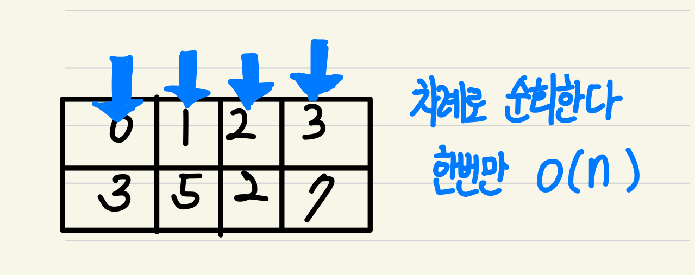
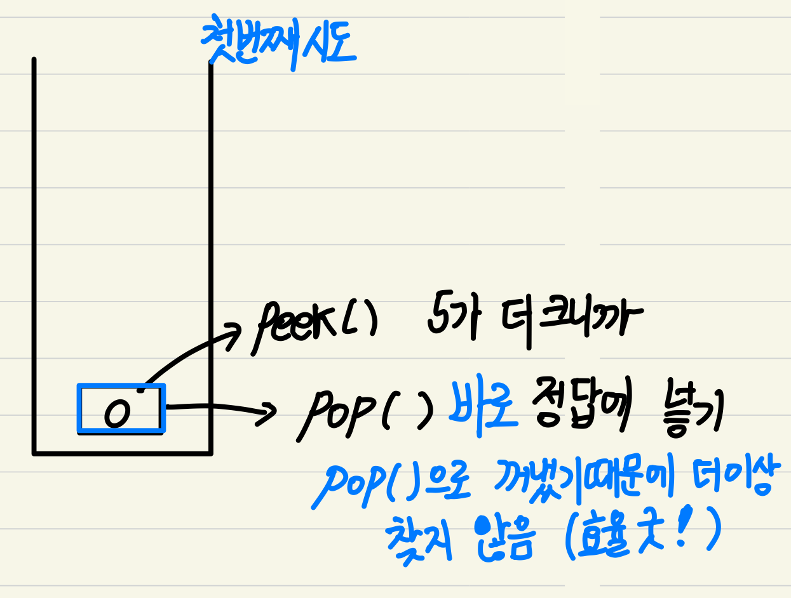

Do it! 알고리즘 코딩 테스트: 자바편 

https://www.acmicpc.net/problem/17298


### 풀이
---
### 📄 1단계 문제 분석하기
---
- 배열로 구현한다면 오류  
- O(N)으로 제한해아함.
- 스택을 사용해야함 

<br>

### 🤘 2단계 손으로 풀기
---




<br>

### 👀 3단계 code 분석 
---
1. index를 순차적으로 방문한다. 

```
for(int i=1; i<n;i++){
//..
    myStack.push(i);
}
```
여기서 차례로 입력받기 때문에 시간복잡도가 O(n) 소모된다. 

<br>

2.해당 인덱스보다 큰 값 찾기! 
```
while(!myStack.isEmpty() && aList[myStack.peek()] < aList[i]){
        answer[myStack.pop()] = aList[i];
}
```
값을 찾으면 해당 인덱스를 POP()으로 꺼내기 때문에 다른 큰 값을 찾기 않는다. (큰 왼쪽값만 찾을 수 있다.) 불필요한 방문하지 않기때문에 복잡도 낮음.
<br>

3.스택에서 꺼내지지 않은 값(큰 값이 없다는 것) -1 대입

```
 while(!myStack.empty()){
    answer[myStack.pop()] = -1;
}
```
스택에서 꺼내지지 않았다는 것은 2번 if문에 들어가지 못해 POP()하지 못해 발생하는 것이다. 즉 자신보다 큰 값이 없다는 이야기이므로 모두 꺼내 그 인덱스에 값을 -1로 대입해준다. 
<br>


---

### 피드백 👩‍🏫
이 문제는 배열로 문제를 해결할 수 없다. 그 이유는 배열은 
O(n*(n+1/2)) == O(n^2)의 시간복잡도가 소요된다. 

ex) <br> [0,1,2,3]이 있을 때 <br>
0번보다 큰 값 찾기 [1,2,3]
1번보다 큰 값 찾기 [2,3]
2번보다 큰 값 찾기 [3]

아무리 코드를 효율적으로 작성한다고 해도 리스트는 기본적으로 모든 값들이 순차적으로 저장되어있어서 삭제,검색,삽입 시간복잡도가 O(n)이기 때문이다. 

<br>
스택 방법을 사용하면, 삽입,삭제가 O(1)이 소모된다. 
<br>
<b>해당 조건을 만족하는 첫번째 경우만 고려할 시 스택을 고려하면 될 것 같다. <b>